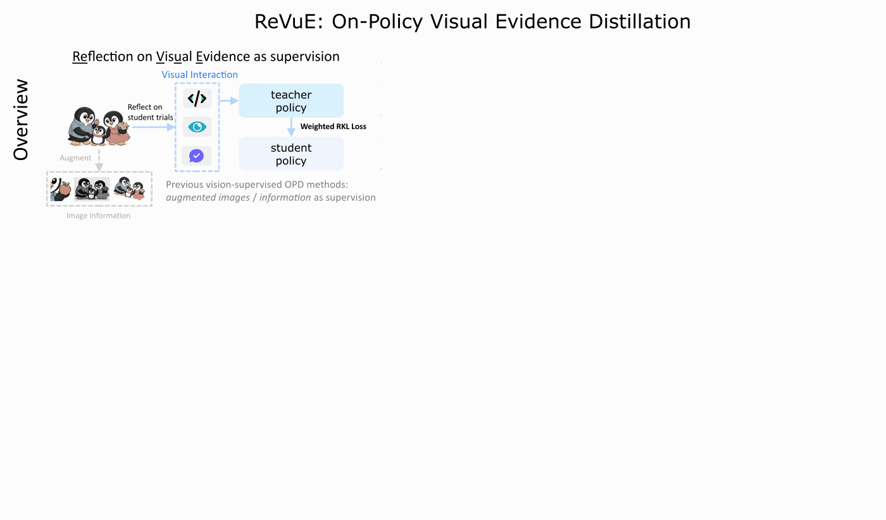
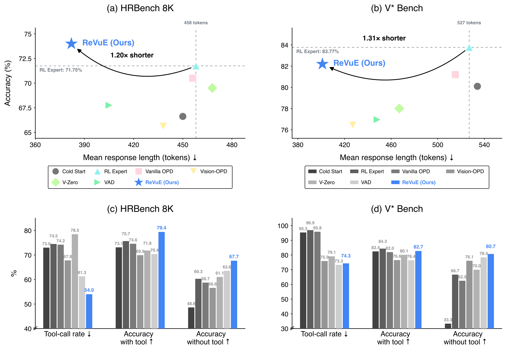

<p align="center">
  
</p>

<h1 align="center">On-Policy Visual Evidence Distillation</h1>

<p align="center">
  Shaohang Wei<sup>1‡*</sup>,
  Feifan Song<sup>1</sup>,
  Guangyue Peng<sup>1</sup>,
  Wenhao Yu<sup>3</sup>,
  Wei Li<sup>1</sup>,
  Wen Luo<sup>1</sup>,<br>
  Yang Xu<sup>4</sup>,
  Yufan Shen<sup>2</sup>,
  Luke Mao<sup>2</sup>,
  Yang Du<sup>2</sup>,
  Asher Qin<sup>2</sup>,
  Houfeng Wang<sup>1†</sup>
</p>

<p align="center">
  <sup>1</sup>Peking University &nbsp; <sup>2</sup>Tencent &nbsp; <sup>3</sup>CUHK &nbsp; <sup>4</sup>Nanjing University
</p>

<p align="center">
  <sup>‡</sup> Project leader &nbsp; <sup>†</sup> Corresponding authors<br>
  <sup>*</sup> Work done during the internship at Tencent.<br>
  Correspondence: <a href="mailto:shaohang@stu.pku.edu.cn">shaohang@stu.pku.edu.cn</a>
</p>

<p align="center">
  <a href="website/assets/documents/revue-paper.pdf"></a>
  <a href="https://sylvain-wei.github.io/ReVuE/"></a>
  <a href="#license-and-acknowledgments"></a>
  <a href="docs/ENVIRONMENT.md"></a>
  <a href="docs/ENVIRONMENT.md"></a>
  <a href="https://github.com/sylvain-wei/ReVuE/actions/workflows/static-checks.yml"></a>
</p>

<p align="center">
  <a href="https://sylvain-wei.github.io/ReVuE/"><b>Project Website ↗</b></a> &nbsp;·&nbsp;
  <a href="#from-visual-evidence-to-better-supervision">Overview</a> &nbsp;·&nbsp;
  <a href="#two-islands-not-one">Token-level case</a> &nbsp;·&nbsp;
  <a href="#main-results">Results</a> &nbsp;·&nbsp;
  <a href="#key-findings">Findings</a> &nbsp;·&nbsp;
  <a href="#getting-started">Getting started</a> &nbsp;·&nbsp;
  <a href="#citation">Citation</a>
</p>

## From visual evidence to better supervision

**ReVuE (Reflection on Visual Evidence)** teaches visual agents to acquire the right evidence, read it correctly, and use it to answer the question. It compares student-generated attempts, diagnoses the first **Acquire → Read → Ground** failure, and supplies the resulting reflection to the teacher during training. Token-level distillation gives greater weight to positions where reflection changes the teacher's predictions most.

<p align="center">
  
</p>

The overview pairs HRBench 8K results with an evidence-use example: crop the blue car, read its plate, and map the plate number to the answer. The student retains its original interaction history; reflection guides the teacher during training.

<sub>[View the complete figure](website/assets/figures/plate-evidence-chain.svg) · [Interactive animation](https://sylvain-wei.github.io/ReVuE/#overview-figure) · [Figure PDF](website/assets/figures/plate-evidence-chain.pdf)</sub>

## Two islands, not one

<p align="center">
  
</p>

The crop shows **two islands**, but the student describes one and answers **Saint Lucia** instead of **Saint Kitts and Nevis**. Reflection lowers teacher support for the intermediate mistake—`island`, `one`, and the first `Lucia`—while the final `Lucia` changes little under the fixed erroneous prefix.

Blue and orange show increased and decreased teacher support. Both evaluations score **the same student trajectory**; the animation reveals its tokens and score changes.

<sub>[View the complete figure](website/assets/figures/two-islands.svg) · [Interactive animation](https://sylvain-wei.github.io/ReVuE/#islands-case) · [Figure PDF](website/assets/figures/two-islands.pdf)</sub>

## Main results

Accuracy (%), higher is better. **Bold** marks the best OPD result in each model family, including ties. Category averages use benchmark sample counts as weights.

### Overview

<table>
  <thead>
    <tr>
      <th rowspan="2" align="left">Method</th>
      <th colspan="3" align="center">Qwen2.5-VL-7B</th>
      <th colspan="3" align="center">InternVL3.5-4B-Instruct</th>
    </tr>
    <tr>
      <th align="right">Perception</th>
      <th align="right">Math</th>
      <th align="right">General</th>
      <th align="right">Perception</th>
      <th align="right">Math</th>
      <th align="right">General</th>
    </tr>
  </thead>
  <tbody>
    <tr><td align="left">Base Model</td><td align="right">57.77</td><td align="right">46.34</td><td align="right">50.53</td><td align="right">49.32</td><td align="right">42.00</td><td align="right">47.78</td></tr>
    <tr><td align="left">Cold-start</td><td align="right">60.72</td><td align="right">46.38</td><td align="right">52.68</td><td align="right">55.66</td><td align="right">47.45</td><td align="right">52.79</td></tr>
    <tr><td align="left">RL Expert</td><td align="right">63.89</td><td align="right">47.56</td><td align="right">53.60</td><td align="right">58.20</td><td align="right">47.60</td><td align="right">54.38</td></tr>
    <tr><td align="left">RFT</td><td align="right">63.12</td><td align="right">46.70</td><td align="right">53.07</td><td align="right">58.22</td><td align="right">46.81</td><td align="right">54.26</td></tr>
    <tr><td align="left">Vanilla OPD</td><td align="right">62.61</td><td align="right">47.67</td><td align="right">53.28</td><td align="right">58.02</td><td align="right">46.34</td><td align="right">53.48</td></tr>
    <tr><td align="left">GT-Privileged</td><td align="right">62.26</td><td align="right">47.49</td><td align="right">53.23</td><td align="right">57.36</td><td align="right">46.09</td><td align="right">53.91</td></tr>
    <tr><td align="left">Vision-OPD</td><td align="right">59.98</td><td align="right">45.48</td><td align="right">52.08</td><td align="right">53.04</td><td align="right">46.02</td><td align="right">54.14</td></tr>
    <tr><td align="left">V-Zero</td><td align="right">62.08</td><td align="right">46.99</td><td align="right">52.79</td><td align="right">54.45</td><td align="right">47.56</td><td align="right">53.99</td></tr>
    <tr><td align="left">VAD</td><td align="right">62.08</td><td align="right">45.62</td><td align="right">53.65</td><td align="right">53.78</td><td align="right">47.45</td><td align="right">54.61</td></tr>
    <tr><td align="left"><b>ReVuE (Ours)</b></td><td align="right"><b>65.01</b></td><td align="right"><b>48.49</b></td><td align="right"><b>54.14</b></td><td align="right"><b>59.72</b></td><td align="right"><b>49.17</b></td><td align="right"><b>55.13</b></td></tr>
  </tbody>
</table>

<sub><a href="https://sylvain-wei.github.io/ReVuE/#results">Explore the interactive results table ↗</a></sub>

<details>
<summary><b>Off-the-shelf models — category averages</b></summary>

<table>
  <thead>
    <tr><th align="left">Model</th><th align="right">Perception</th><th align="right">Math</th><th align="right">General</th></tr>
  </thead>
  <tbody>
    <tr><td>GPT-4o</td><td align="right">50.28</td><td align="right">41.22</td><td align="right">53.28</td></tr>
    <tr><td>Gemini3.1FL</td><td align="right">43.89</td><td align="right">62.63</td><td align="right">63.57</td></tr>
    <tr><td>Qwen2.5-32B</td><td align="right">63.89</td><td align="right">51.90</td><td align="right">59.29</td></tr>
    <tr><td>Qwen3-30B-T</td><td align="right">63.26</td><td align="right">56.71</td><td align="right">64.45</td></tr>
    <tr><td>InternVL-38B</td><td align="right">54.34</td><td align="right">48.89</td><td align="right">55.71</td></tr>
  </tbody>
</table>

</details>

<details>
<summary><b>Perception — all benchmark results</b></summary>

<table>
  <thead>
    <tr>
      <th align="left"><sub>Model / Method</sub></th>
      <th align="right"><sub>HRBench 4K</sub></th>
      <th align="right"><sub>HRBench 8K</sub></th>
      <th align="right"><sub>V*Bench</sub></th>
      <th align="right"><sub>TreeBench</sub></th>
      <th align="right"><sub>VisualProbe</sub></th>
      <th align="right"><sub>Wtd. Avg.</sub></th>
    </tr>
  </thead>
  <tbody>
    <tr><th colspan="7" align="left"><sub>Off-the-Shelf Models</sub></th></tr>
    <tr><td>GPT-4o</td><td align="right">61.00</td><td align="right">54.00</td><td align="right">61.78</td><td align="right">49.88</td><td align="right">23.88</td><td align="right">50.28</td></tr>
    <tr><td>Gemini3.1FL</td><td align="right">46.00</td><td align="right">43.00</td><td align="right">64.92</td><td align="right">51.85</td><td align="right">27.96</td><td align="right">43.89</td></tr>
    <tr><td>Qwen2.5-32B</td><td align="right">75.13</td><td align="right">69.25</td><td align="right">78.01</td><td align="right">48.40</td><td align="right">45.05</td><td align="right">63.89</td></tr>
    <tr><td>Qwen3-30B-T</td><td align="right">77.13</td><td align="right">71.38</td><td align="right">80.10</td><td align="right">45.43</td><td align="right">36.89</td><td align="right">63.26</td></tr>
    <tr><td>InternVL-38B</td><td align="right">71.50</td><td align="right">62.13</td><td align="right">65.97</td><td align="right">41.98</td><td align="right">20.97</td><td align="right">54.34</td></tr>
    <tr><th colspan="7" align="left"><sub>Qwen2.5-VL-7B</sub></th></tr>
    <tr><td>Base Model</td><td align="right">69.00</td><td align="right">63.50</td><td align="right">75.39</td><td align="right">37.04</td><td align="right">41.17</td><td align="right">57.77</td></tr>
    <tr><td>Cold-start</td><td align="right">74.38</td><td align="right">66.62</td><td align="right">80.10</td><td align="right">37.28</td><td align="right">41.56</td><td align="right">60.72</td></tr>
    <tr><td>RL Expert</td><td align="right">75.50</td><td align="right">71.75</td><td align="right">83.77</td><td align="right">40.25</td><td align="right">44.85</td><td align="right">63.89</td></tr>
    <tr><td>RFT</td><td align="right">75.38</td><td align="right">72.00</td><td align="right">81.20</td><td align="right">40.00</td><td align="right">41.75</td><td align="right">63.12</td></tr>
    <tr><td>Vanilla OPD</td><td align="right">75.40</td><td align="right">70.50</td><td align="right">81.20</td><td align="right">38.02</td><td align="right">42.91</td><td align="right">62.61</td></tr>
    <tr><td>GT-Privileged</td><td align="right">73.62</td><td align="right">70.50</td><td align="right">79.58</td><td align="right">39.75</td><td align="right">43.10</td><td align="right">62.26</td></tr>
    <tr><td>Vision-OPD</td><td align="right">73.00</td><td align="right">65.62</td><td align="right">76.44</td><td align="right">39.01</td><td align="right">41.36</td><td align="right">59.98</td></tr>
    <tr><td>V-Zero</td><td align="right">75.62</td><td align="right">69.50</td><td align="right">78.01</td><td align="right">37.28</td><td align="right">43.10</td><td align="right">62.08</td></tr>
    <tr><td>VAD</td><td align="right">74.75</td><td align="right">67.75</td><td align="right">76.96</td><td align="right"><b>41.98</b></td><td align="right">43.89</td><td align="right">62.08</td></tr>
    <tr><td><b>ReVuE (Ours)</b></td><td align="right"><b>77.10</b></td><td align="right"><b>74.00</b></td><td align="right"><b>82.20</b></td><td align="right">41.12</td><td align="right"><b>44.66</b></td><td align="right"><b>65.01</b></td></tr>
    <tr><th colspan="7" align="left"><sub>InternVL3.5-4B-Instruct</sub></th></tr>
    <tr><td>Base Model</td><td align="right">62.00</td><td align="right">55.00</td><td align="right">68.59</td><td align="right">40.49</td><td align="right">20.58</td><td align="right">49.32</td></tr>
    <tr><td>Cold-start</td><td align="right">69.50</td><td align="right">63.25</td><td align="right">66.49</td><td align="right">40.99</td><td align="right">29.90</td><td align="right">55.66</td></tr>
    <tr><td>RL Expert</td><td align="right">72.62</td><td align="right">64.62</td><td align="right">71.73</td><td align="right">40.74</td><td align="right">34.56</td><td align="right">58.20</td></tr>
    <tr><td>RFT</td><td align="right">71.25</td><td align="right">66.00</td><td align="right">71.73</td><td align="right">40.25</td><td align="right">35.00</td><td align="right">58.22</td></tr>
    <tr><td>Vanilla OPD</td><td align="right">71.13</td><td align="right">65.87</td><td align="right"><b>73.30</b></td><td align="right">40.25</td><td align="right">33.79</td><td align="right">58.02</td></tr>
    <tr><td>GT-Privileged</td><td align="right">71.25</td><td align="right">64.88</td><td align="right">70.16</td><td align="right">39.75</td><td align="right">33.20</td><td align="right">57.36</td></tr>
    <tr><td>Vision-OPD</td><td align="right">66.25</td><td align="right">60.00</td><td align="right">65.97</td><td align="right">37.78</td><td align="right">28.93</td><td align="right">53.04</td></tr>
    <tr><td>V-Zero</td><td align="right">68.13</td><td align="right">61.75</td><td align="right">67.02</td><td align="right">40.25</td><td align="right">28.35</td><td align="right">54.45</td></tr>
    <tr><td>VAD</td><td align="right">67.50</td><td align="right">61.00</td><td align="right">67.02</td><td align="right">39.01</td><td align="right">27.96</td><td align="right">53.78</td></tr>
    <tr><td><b>ReVuE (Ours)</b></td><td align="right"><b>73.25</b></td><td align="right"><b>67.37</b></td><td align="right"><b>73.30</b></td><td align="right"><b>41.48</b></td><td align="right"><b>36.12</b></td><td align="right"><b>59.72</b></td></tr>
  </tbody>
</table>

</details>

<details>
<summary><b>Math — all benchmark results</b></summary>

<table>
  <thead>
    <tr>
      <th align="left"><sub>Model / Method</sub></th>
      <th align="right"><sub>MathVista</sub></th>
      <th align="right"><sub>MathVerse</sub></th>
      <th align="right"><sub>VisuLogic</sub></th>
      <th align="right"><sub>Wtd. Avg.</sub></th>
    </tr>
  </thead>
  <tbody>
    <tr><th colspan="5" align="left"><sub>Off-the-Shelf Models</sub></th></tr>
    <tr><td>GPT-4o</td><td align="right">58.83</td><td align="right">39.21</td><td align="right">25.20</td><td align="right">41.22</td></tr>
    <tr><td>Gemini3.1FL</td><td align="right">80.80</td><td align="right">77.92</td><td align="right">32.40</td><td align="right">62.63</td></tr>
    <tr><td>Qwen2.5-32B</td><td align="right">77.00</td><td align="right">53.05</td><td align="right">25.90</td><td align="right">51.90</td></tr>
    <tr><td>Qwen3-30B-T</td><td align="right">80.20</td><td align="right">66.12</td><td align="right">25.80</td><td align="right">56.71</td></tr>
    <tr><td>InternVL-38B</td><td align="right">70.90</td><td align="right">48.48</td><td align="right">27.20</td><td align="right">48.89</td></tr>
    <tr><th colspan="5" align="left"><sub>Qwen2.5-VL-7B</sub></th></tr>
    <tr><td>Base Model</td><td align="right">69.10</td><td align="right">44.04</td><td align="right">25.40</td><td align="right">46.34</td></tr>
    <tr><td>Cold-start</td><td align="right">68.00</td><td align="right">44.29</td><td align="right">26.40</td><td align="right">46.38</td></tr>
    <tr><td>RL Expert</td><td align="right">70.60</td><td align="right">45.43</td><td align="right">26.20</td><td align="right">47.56</td></tr>
    <tr><td>RFT</td><td align="right">69.50</td><td align="right">45.81</td><td align="right">24.60</td><td align="right">46.70</td></tr>
    <tr><td>Vanilla OPD</td><td align="right">70.60</td><td align="right">46.07</td><td align="right">26.00</td><td align="right">47.67</td></tr>
    <tr><td>GT-Privileged</td><td align="right">71.20</td><td align="right">45.69</td><td align="right">25.20</td><td align="right">47.49</td></tr>
    <tr><td>Vision-OPD</td><td align="right">67.70</td><td align="right">42.39</td><td align="right">25.70</td><td align="right">45.48</td></tr>
    <tr><td>V-Zero</td><td align="right">69.80</td><td align="right">43.91</td><td align="right"><b>26.60</b></td><td align="right">46.99</td></tr>
    <tr><td>VAD</td><td align="right">69.00</td><td align="right">45.56</td><td align="right">22.30</td><td align="right">45.62</td></tr>
    <tr><td><b>ReVuE (Ours)</b></td><td align="right"><b>71.60</b></td><td align="right"><b>47.08</b></td><td align="right">26.50</td><td align="right"><b>48.49</b></td></tr>
    <tr><th colspan="5" align="left"><sub>InternVL3.5-4B-Instruct</sub></th></tr>
    <tr><td>Base Model</td><td align="right">68.50</td><td align="right">28.93</td><td align="right">25.80</td><td align="right">42.00</td></tr>
    <tr><td>Cold-start</td><td align="right">69.30</td><td align="right">47.21</td><td align="right">25.80</td><td align="right">47.45</td></tr>
    <tr><td>RL Expert</td><td align="right">69.30</td><td align="right">46.32</td><td align="right">26.90</td><td align="right">47.60</td></tr>
    <tr><td>RFT</td><td align="right">70.00</td><td align="right">45.94</td><td align="right">24.30</td><td align="right">46.81</td></tr>
    <tr><td>Vanilla OPD</td><td align="right">68.40</td><td align="right">43.40</td><td align="right">26.60</td><td align="right">46.34</td></tr>
    <tr><td>GT-Privileged</td><td align="right">71.30</td><td align="right">39.34</td><td align="right">26.20</td><td align="right">46.09</td></tr>
    <tr><td>Vision-OPD</td><td align="right">66.60</td><td align="right">44.54</td><td align="right">26.60</td><td align="right">46.02</td></tr>
    <tr><td>V-Zero</td><td align="right">68.80</td><td align="right">46.95</td><td align="right">26.80</td><td align="right">47.56</td></tr>
    <tr><td>VAD</td><td align="right">68.30</td><td align="right">46.07</td><td align="right">27.70</td><td align="right">47.45</td></tr>
    <tr><td><b>ReVuE (Ours)</b></td><td align="right"><b>71.60</b></td><td align="right"><b>47.46</b></td><td align="right"><b>28.10</b></td><td align="right"><b>49.17</b></td></tr>
  </tbody>
</table>

</details>

<details>
<summary><b>General — all benchmark results</b></summary>

<table>
  <thead>
    <tr>
      <th align="left"><sub>Model / Method</sub></th>
      <th align="right"><sub>HallusionBench</sub></th>
      <th align="right"><sub>ChartQA-Pro</sub></th>
      <th align="right"><sub>InfographicVQA</sub></th>
      <th align="right"><sub>Wtd. Avg.</sub></th>
    </tr>
  </thead>
  <tbody>
    <tr><th colspan="5" align="left"><sub>Off-the-Shelf Models</sub></th></tr>
    <tr><td>GPT-4o</td><td align="right">51.37</td><td align="right">28.67</td><td align="right">71.17</td><td align="right">53.28</td></tr>
    <tr><td>Gemini3.1FL</td><td align="right">59.92</td><td align="right">37.03</td><td align="right">83.50</td><td align="right">63.57</td></tr>
    <tr><td>Qwen2.5-32B</td><td align="right">50.74</td><td align="right">30.02</td><td align="right">83.10</td><td align="right">59.29</td></tr>
    <tr><td>Qwen3-30B-T</td><td align="right">61.82</td><td align="right">35.46</td><td align="right">85.68</td><td align="right">64.45</td></tr>
    <tr><td>InternVL-38B</td><td align="right">50.74</td><td align="right">26.98</td><td align="right">77.70</td><td align="right">55.71</td></tr>
    <tr><th colspan="5" align="left"><sub>Qwen2.5-VL-7B</sub></th></tr>
    <tr><td>Base Model</td><td align="right">40.91</td><td align="right">20.79</td><td align="right">75.10</td><td align="right">50.53</td></tr>
    <tr><td>Cold-start</td><td align="right">41.73</td><td align="right">21.12</td><td align="right">79.05</td><td align="right">52.68</td></tr>
    <tr><td>RL Expert</td><td align="right">43.83</td><td align="right">21.69</td><td align="right">79.74</td><td align="right">53.60</td></tr>
    <tr><td>RFT</td><td align="right">42.33</td><td align="right">21.18</td><td align="right">79.57</td><td align="right">53.07</td></tr>
    <tr><td>Vanilla OPD</td><td align="right">42.88</td><td align="right">21.69</td><td align="right">79.44</td><td align="right">53.28</td></tr>
    <tr><td>GT-Privileged</td><td align="right">43.45</td><td align="right">20.84</td><td align="right">79.70</td><td align="right">53.23</td></tr>
    <tr><td>Vision-OPD</td><td align="right">39.89</td><td align="right">20.79</td><td align="right">78.75</td><td align="right">52.08</td></tr>
    <tr><td>V-Zero</td><td align="right">42.16</td><td align="right">21.08</td><td align="right">79.12</td><td align="right">52.79</td></tr>
    <tr><td>VAD</td><td align="right">44.24</td><td align="right">21.73</td><td align="right">79.65</td><td align="right">53.65</td></tr>
    <tr><td><b>ReVuE (Ours)</b></td><td align="right"><b>45.12</b></td><td align="right"><b>21.81</b></td><td align="right"><b>80.27</b></td><td align="right"><b>54.14</b></td></tr>
    <tr><th colspan="5" align="left"><sub>InternVL3.5-4B-Instruct</sub></th></tr>
    <tr><td>Base Model</td><td align="right">40.04</td><td align="right">26.01</td><td align="right">66.04</td><td align="right">47.78</td></tr>
    <tr><td>Cold-start</td><td align="right">48.50</td><td align="right">26.24</td><td align="right">72.98</td><td align="right">52.79</td></tr>
    <tr><td>RL Expert</td><td align="right">46.92</td><td align="right">30.59</td><td align="right">73.93</td><td align="right">54.38</td></tr>
    <tr><td>RFT</td><td align="right">47.78</td><td align="right">29.39</td><td align="right">74.17</td><td align="right">54.26</td></tr>
    <tr><td>Vanilla OPD</td><td align="right">46.85</td><td align="right">30.46</td><td align="right">72.16</td><td align="right">53.48</td></tr>
    <tr><td>GT-Privileged</td><td align="right">49.29</td><td align="right">29.90</td><td align="right">72.48</td><td align="right">53.91</td></tr>
    <tr><td>Vision-OPD</td><td align="right">44.57</td><td align="right">30.46</td><td align="right"><b>74.47</b></td><td align="right">54.14</td></tr>
    <tr><td>V-Zero</td><td align="right">49.03</td><td align="right">28.65</td><td align="right">73.61</td><td align="right">53.99</td></tr>
    <tr><td>VAD</td><td align="right">48.05</td><td align="right">31.44</td><td align="right">73.36</td><td align="right">54.61</td></tr>
    <tr><td><b>ReVuE (Ours)</b></td><td align="right"><b>49.38</b></td><td align="right"><b>32.27</b></td><td align="right">73.35</td><td align="right"><b>55.13</b></td></tr>
  </tbody>
</table>

</details>

MathVista uses the Mini split; MathVerse uses the vision-only split. Gemini3.1FL denotes Gemini-3.1-Flash-Lite; Qwen2.5-32B, Qwen3-30B-T, and InternVL-38B denote Qwen2.5-VL-32B, Qwen3-VL-30B-A3B-Thinking, and InternVL3.5-38B-Instruct.

## Accuracy, response length, and tool use

<p align="center">
  
</p>

**A–B:** Accuracy versus mean response length on HRBench 8K and V\* Bench. **C–D:** Tool-use rate and answer accuracy on samples with and without tool use, for the same two benchmarks. All four panels use Qwen2.5-VL-7B.

<sub>[Vector figure](website/assets/figures/efficiency.svg) · [Figure PDF](website/assets/figures/efficiency.pdf)</sub>

| Benchmark | Method | Accuracy (%) | Mean response tokens | Tool-use rate (%) |
| :-- | :-- | --: | --: | --: |
| HRBench 8K | Vanilla OPD | 70.50 | 456 | 74.2 |
| HRBench 8K | ReVuE (Ours) | 74.00 | 382 | 54.0 |
| V\* Bench | Vanilla OPD | 81.20 | 515 | 95.8 |
| V\* Bench | ReVuE (Ours) | 82.20 | 401 | 74.3 |

## Key findings

- **Category gains in both model families.** Across 11 benchmarks, ReVuE leads all evaluated OPD methods in the three weighted category averages for both Qwen2.5-VL-7B and InternVL3.5-4B-Instruct. Perception rises from **62.61% to 65.01%** for Qwen and from **58.02% to 59.72%** for InternVL over Vanilla OPD (Table 1).
- **Higher accuracy with shorter responses and less frequent tool use.** The four panels show these gains over Vanilla OPD on HRBench 8K and V\* Bench. On HRBench 8K, ReVuE also exceeds its RL Expert teacher: **74.00% vs. 71.75%** accuracy with **382 vs. 458** mean response tokens.
- **Useful supervision can appear before the final answer.** In the two-island case, reflection lowers teacher support for the intermediate one-island judgment even though the final-answer token changes little under the fixed erroneous prefix. Both scores refer to the same student trajectory.

## Getting started

The release includes ReVuE training and evaluation for **Qwen2.5-VL-7B** and **InternVL3.5-4B**, together with data preparation, the InternVL SFT stages, frozen-teacher recipes, and judge-service integration. Start with the [complete running guide](docs/RUNNING.md).

| Step | Guide |
| :-- | :-- |
| Install the training environment | [Environment and dependencies](docs/ENVIRONMENT.md) |
| Prepare student, frozen teacher, and training data | [Model resources and recipes](docs/EXPERIMENTS.md) · [Training data](docs/DATA.md) |
| Start and verify the critic / judge | [Judge service](docs/JUDGE_SERVICE.md) |
| Prepare evaluation benchmarks | [Evaluation data](docs/EVAL_DATA.md) |
| Check release scope and provenance | [Validation](VALIDATION.md) · [Source provenance](docs/PROVENANCE.md) |

### Installation

The target environment is **Linux, Python 3.10, CUDA 12.6, and PyTorch 2.7**. The main training recipe uses **8 GPUs**; the reported training setup used 8 × H20 (96 GB), with a separate judge service. Model checkpoints and benchmark datasets are supplied separately.

Clone the repository, then install the dependencies:

```bash
git clone https://github.com/sylvain-wei/ReVuE.git
cd ReVuE

conda create -n revue python=3.10 -y
export ENV_NAME="revue"
source thyme-infer/activate_thyme.sh

python -m pip install torch==2.7.0 torchvision==0.22.0 \
  --index-url https://download.pytorch.org/whl/cu126
python -m pip install packaging psutil ninja setuptools wheel
python -m pip install flash-attn==2.8.3 --no-build-isolation
python -m pip install -r requirements.txt
python -m pip install -e ./thyme-infer/Thyme
python -m pip install -e ./thyme-infer/Thyme/eval/VLMEvalKit
python -m pip check
```

FlashAttention needs a compatible CUDA build toolchain. Follow the [environment guide](docs/ENVIRONMENT.md) for the recorded package versions and installation constraints.

### Prepare resources and the judge

1. Prepare the RL dataset and local image paths using the [data guide](docs/DATA.md). For InternVL, run the two SFT stages documented in [EXPERIMENTS.md](docs/EXPERIMENTS.md).
2. Supply the cold-start student and its matched frozen RL teacher. The report used locally reproduced teachers; a public Thyme-RL checkpoint is not a verified substitute.
3. Configure the OpenAI-compatible judge and the reward, reflection, and scoring endpoint variables in [JUDGE_SERVICE.md](docs/JUDGE_SERVICE.md). Run its schema and two-image smoke checks before training.

### Train ReVuE

**Qwen2.5-VL-7B**

```bash
export ENV_NAME="revue"
source thyme-infer/activate_thyme.sh
export SFT_CKPT="/path/to/student-checkpoint"
export RL_DATA_DIR="/path/to/training-dataset"

bash thyme-infer/scripts/launch_gcep.sh \
  --mode strong_opd_gcep_combined_v2 \
  --teacher-ckpt "/path/to/teacher-checkpoint" \
  --lr 1e-6 --max-steps 1075 \
  "/path/to/training-output"
```

**InternVL3.5-4B**

```bash
export ENV_NAME="revue"
source thyme-infer/activate_thyme.sh
export INTERNVL_SFT_CKPT="/path/to/internvl-sft-checkpoint"
export RL_DATA_DIR="/path/to/training-dataset"

bash thyme-infer/scripts/launch_gcep_internvl.sh \
  --mode strong_opd_gcep_combined_v2 \
  --teacher-ckpt "/path/to/internvl-teacher-checkpoint" \
  --lr 1e-6 \
  "/path/to/internvl-training-output"
```

The InternVL command retains the launcher’s default 1,075-step schedule. The report evaluated checkpoint 350; that checkpoint number does not establish the original run’s total training horizon.

The main configuration uses 8 generations, learning rate `1e-6`, seed `42`, teacher support size `32`, and high-impact fraction `0.2`. High- and low-impact groups receive equal total loss weight. See the [full recipes](docs/EXPERIMENTS.md) for SFT, teacher training, and checkpoint details.

### Evaluate on 11 benchmarks

Prepare the datasets and judge using [EVAL_DATA.md](docs/EVAL_DATA.md) and [JUDGE_SERVICE.md](docs/JUDGE_SERVICE.md), then run:

```bash
export ENV_NAME="revue"
source thyme-infer/activate_thyme.sh
bash thyme-infer/scripts/run_11bench_eval_suite.sh \
  "/path/to/evaluation-checkpoint" \
  "/path/to/evaluation-output"
```

The suite covers **HRBench 4K, HRBench 8K, V\* Bench, TreeBench, VisualProbe, MathVista, MathVerse, VisuLogic, HallusionBench, ChartQA-Pro, and InfographicVQA**. VisualProbe's Easy / Medium / Hard splits count as one benchmark. The [running guide](docs/RUNNING.md#5-evaluation) also covers benchmark subsets and smoke runs.

### Code map

```text
src/m_rlsd/                        Shared ReVuE helpers
thyme-infer/scripts/               Training, teacher, SFT, and evaluation entrypoints
thyme-infer/scripts/gcep_bench/    Dataset builders and benchmark scorers
thyme-infer/Thyme/                Modified training framework and VLMEvalKit
data_prep/                       Data preparation notes and resources
tools/                          Data conversion, verification, and static checks
docs/                           Complete environment and execution guides
website/                        Interactive project website
assets/                         README animations and ReVuE branding
```

### Checks and release scope

```bash
python tools/check_repository.py
```

The **Static checks** workflow checks source syntax, release entrypoints, metadata, and retained license integrity. The [validation record](VALIDATION.md) distinguishes current checks from the earlier mocked release tests. Fresh Linux/CUDA installation, GPU training, live-judge inference, and reproduction of the reported scores remain unverified.

This release supplies the main method; standalone comparison-method implementations, ablation runners, experiment archives, model weights, and benchmark datasets are not bundled. The image-tool executor runs generated Python; use the isolated environment described in [the execution guide](docs/RUNNING.md#6-execution-boundary-and-validation-status).

## License and acknowledgments

A general open-source license for original ReVuE code is pending selection. Existing third-party licenses remain in force; see [THIRD_PARTY_NOTICES.md](THIRD_PARTY_NOTICES.md) and [licenses/](licenses/).

ReVuE builds on [Thyme](https://github.com/Kwai-Keye/Thyme), [ms-swift](https://github.com/modelscope/ms-swift), and [VLMEvalKit](https://github.com/open-compass/VLMEvalKit). We thank the benchmark and framework authors whose work makes these experiments possible.

Banner photograph by [Jasper Wilde on Unsplash](https://unsplash.com/photos/boys-blue-eyes-Sk3fZLg-zTc). Branding and figure-source details are in [assets/README.md](assets/README.md).

## Citation

```bibtex
@misc{revue,
  author = {Shaohang Wei and Feifan Song and Guangyue Peng and
            Wenhao Yu and Wei Li and Wen Luo and
            Yang Xu and Yufan Shen and Luke Mao and
            Yang Du and Asher Qin and Houfeng Wang},
  title  = {On-Policy Visual Evidence Distillation},
  year   = {2026},
  note   = {Technical report}
}
```
